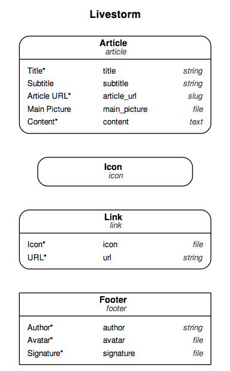

# Livestorm Technical Test

This repo contains a static website written with [GatsbyJS](https://www.gatsbyjs.org/), integrated with content coming from [DatoCMS](https://www.datocms.com).

[See the live demo](http://youthful-pasteur-22ed6b.netlify.com)

> *([DatoCMS-demo/admin](https://livestorm-2274.admin.datocms.com/admin))*

If you want to use try this out yourself, you first need to set up a project on DatoCMS which will host your data.

## Repo usage

First, install the dependencies of this project:

```
npm install
```

Add an `.env` file containing the read-only API token of your DatoCMS site:

```
echo 'DATO_API_TOKEN=abc123' >> .env
```

Then, to run this website in development mode (with live-reload):

```
npm run develop
```

To build the final, production ready static website:

```
npm run build
```

The final result will be saved in the `public` directory.

## Development Guide

### 1. Authentify to DatoCMS
Get your API key in your Dato admin panel: `Admin > Settings > API Token`
( you have to be invited by mail )
then at the root directory:
```
echo 'DATO_API_TOKEN=[YOUR_API_KEY]' >> .env
```

### 2. Manage Articles
You can add or modify your own articles by accessing the Dato admin panel :
`Admin > Content > Article (> New Record)`

Click `Publish` to publish your article. Just `Save` to put it on Draft mode

### 3. Preview changes
Run the project locally to see changes in Development Mode (Draft articles will be loaded)
Change **previewMode** variable in `Gatsby-config.js` to disable this.

### 4. Deploy
Click on the `Deployement status` button on the top-right of the DatoCMS
if not *''Deployed and up to date''*, you can trigger the deploy by clicking `Deploy Now`
 
### 5. Rebuild you own DatoCMS
You can clone this project and connect with your own DatoCMS project by reproducing this model:



Take a look at the GraphQL requests for better understanding


# Test Subject

## Growth Engineer test

Adapter la stack du site statique sera une des tes missions principales en tant que
growth engineer chez Livestorm.

Ce test est un moyen pour nous de mesurer ta capacité d'adaptation, ainsi que ta
connaissance (ou apprentissage) des notions importantes de la JAMStack, sur
quoi repose notre site statique.

Ce test nous aussi sert à évaluer la clarté de ton code et tes explications. En
effet, dans une équipe en constante croissance, savoir exprimer ses choix
clairement est un must !

**Une attention particulière sera donc portée:**

 - Au respect des consignes
 - A la clarté du code et de tes explications
 - A la logique des choix proposés ainsi que la facilité d'utilisation
   dans le cadre d'une entreprise

### Tasks

Créer un site statique sur le format JAMStack. C'est à dire qui comporte :

1. Un headless CMS. Nous utilisons DatoCMS chez Livestorm.
Alternatives : Prismic...

2. Un Générateur de Site Statique (aka SSG in english 󾓪), nous utilisons
Middleman chez Livestorm.
Alternatives : Gridsome, GatsbyJS ou tout autre SSG basé sur du JS.

3. Hosting sur Netlify

4. Créer une documentation permettant de créer un article et de deploy le site
de notre côté

## Deliverables

Un blog avec un index d'articles et un template d'article fonctionnels :

 - 2 articles (en lorem ipsum, créés via le CMS qui comportent cover
   image
 - gestion basique de format (h1/h2/p/img au minimum)
 - Thème qui respecte le template ci-joint (section "Documents"), noter
   que:
    - pas besoin de respecter les icones/pictos présents sur l'exemple
	 - pas besoin d'appliquer les soulignages. Exemple dans le 1er paragraphe en
	   light font du blog post.
  
 - Code hébergé sur Github
 - Hosting sur Netlify : Il faut pouvoir tester de notre côté l'ajout d'un article et le
   deploy. Pour ça nous avons besoin d'une documentation expliquant
   comment mettre le site en prod.
